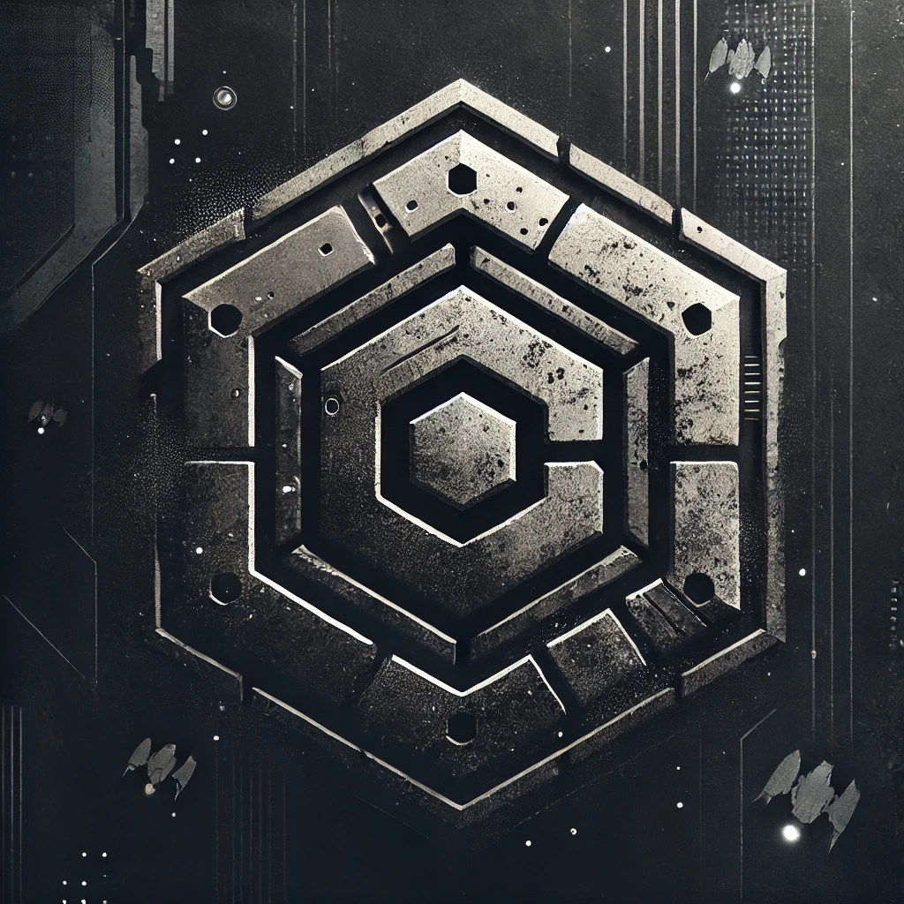

# Game Concept Experimentation Repository

This repository is dedicated to building and testing various components for a large-scale sandbox project. The goal is to experiment with and validate different concepts and features that could be part of a future game. This is not an actual game, but a project to build out experiments to test these concepts together.

## Challenges and Goals
1. Generate a proportionately scaled 3D environment.
2. Implement server-side programming.
3. Develop economic functions.
4. Create crafting mechanics.

## Purpose of This Repository

This repository serves as a testing ground for various components and features that could be part of a future project. It includes prototypes, experiments, and proof-of-concept implementations to validate ideas and ensure they work as intended before being integrated into a larger project. This is not an actual game, but a project to build out experiments to test these concepts together.

***